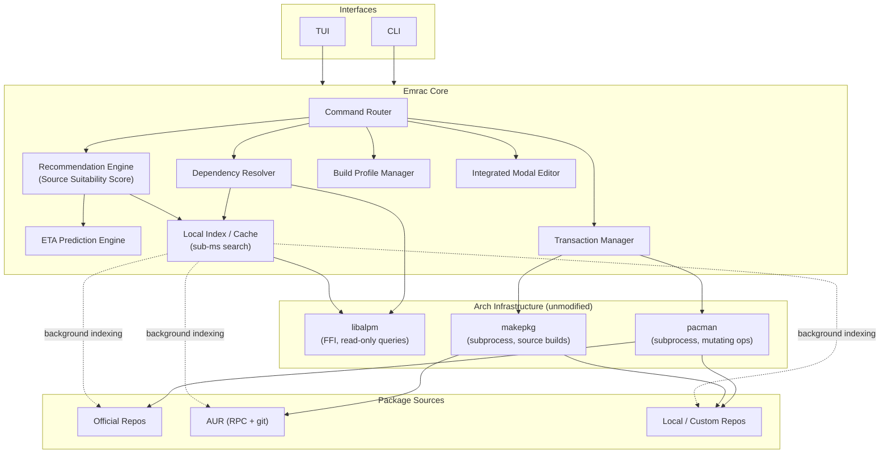
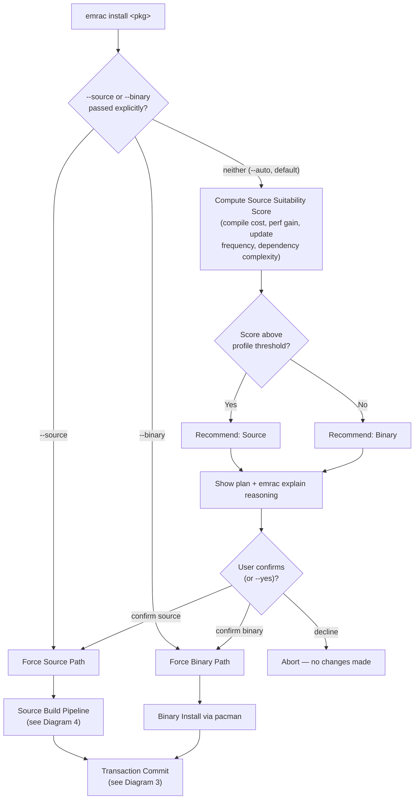
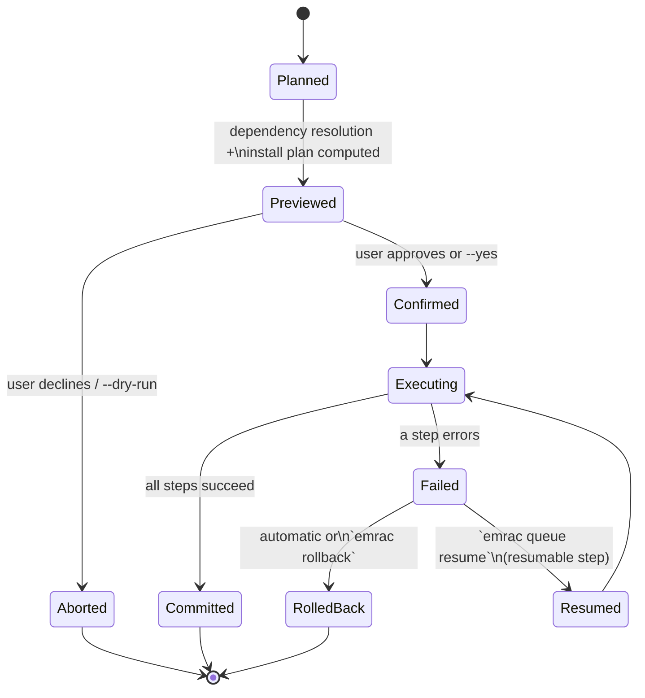
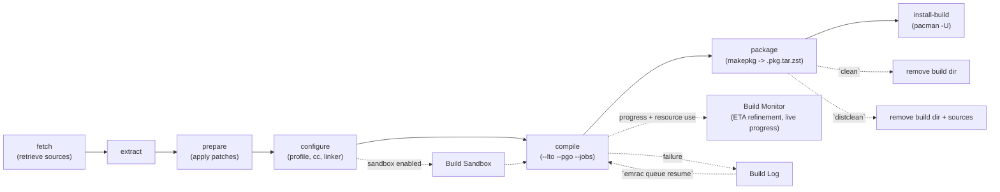
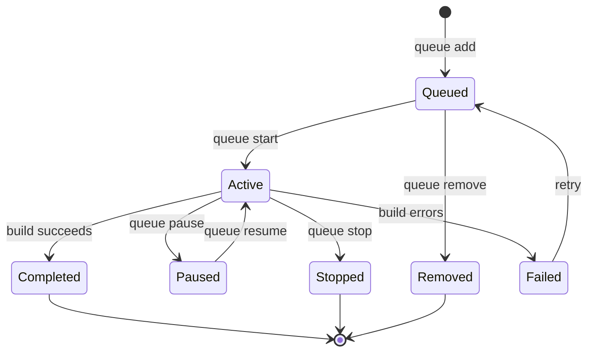
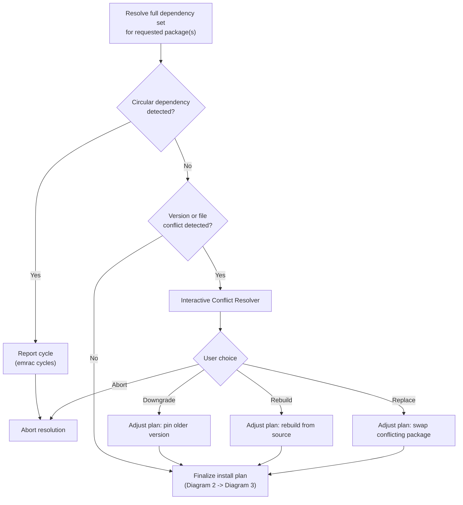
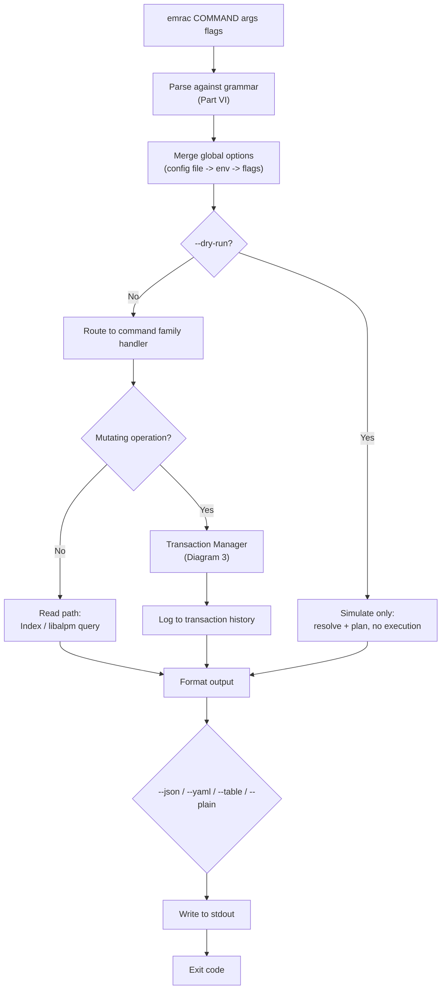

# Emrac — Complete Specification

*A source-first package management platform for Arch Linux.*

This document consolidates and completes everything described in `emrac.md`. That file was a design brainstorm — it contained an incomplete grammar, per-command option sheets filled in for only a handful of commands (with a literal "continue this for every command" placeholder), and a growing pile of feature ideas layered on top of each other with some naming collisions. This document resolves those gaps into one internally-consistent reference. Where a judgment call was required to resolve an ambiguity, it's flagged in **Part IX — Editorial Notes**, so nothing is silently changed.

**Contents**

- Part I — Vision & Philosophy
- Part II — Core Philosophy
- Part III — Complete Feature Catalog
- Part IV — Signature & Advanced Features
- Part V — Command Catalog
- Part VI — Formal Grammar (EBNF)
- Part VII — Global Options Reference
- Part VIII — Per-Command Option Reference
- Part IX — Editorial Notes (ambiguities resolved)
- Part X — Implementation Notes (architecture decisions)
- Part XI — Flowcharts & Diagrams

---

# Part I — Vision & Philosophy

Emrac is a modern, source-first package management platform for the Arch Linux ecosystem that reimagines how users discover, build, install, maintain, and understand software. Rather than replacing the proven foundations of Arch, Emrac builds on them, acting as an intelligent orchestration layer over the existing package infrastructure while providing a cohesive command-line and terminal user interface experience. The goal is to preserve Arch's simplicity and transparency while eliminating much of the repetitive work and fragmented tooling that users encounter today.

At its core, Emrac embraces the philosophy that package management should not simply be about downloading software — it should be about understanding the software ecosystem installed on a system. Traditional package managers primarily answer questions such as "What package should I install?" Emrac expands this into questions like "Why is this package installed?", "How was it built?", "What depends on it?", "How does rebuilding it affect my system?", and "What optimizations are available for my hardware?" In this sense, Emrac aims to become an interactive operating environment for package management rather than a collection of disconnected commands.

### Source-First Philosophy

Whenever practical, software is built locally from source using Arch's existing PKGBUILD infrastructure. This provides transparency, reproducibility, and opportunities for optimization while remaining fully compatible with the Arch ecosystem. Not every situation warrants compilation, though — binary packages remain a first-class option, letting users choose between rapid installation and customized local builds depending on their priorities. This serves both developers who enjoy fine-grained control and users who simply want software installed quickly.

### One Interface Over All Sources

Official Arch repositories, the AUR, locally maintained PKGBUILDs, custom repositories, and locally built packages are presented through a single workflow. Regardless of where a package originates, searching, inspecting, installing, rebuilding, or removing it feels identical from the user's perspective. By hiding unnecessary distinctions without sacrificing transparency, Emrac reduces cognitive overhead while preserving the power experienced Arch users expect.

### Performance as a Design Objective

Emrac is intended to deliver an exceptionally responsive experience through aggressive indexing, metadata caching, efficient search algorithms, and optimized data structures. Common operations — package lookup, fuzzy search, dependency inspection, metadata retrieval — should feel effectively instantaneous on modern hardware. Rather than repeatedly scanning package databases, Emrac maintains optimized local indexes enabling interactive browsing at sub-millisecond latency. Network transfers and source compilation will always dominate installation time, but the interactive experience itself should never become a bottleneck.

### A Complete Terminal User Interface

The TUI is a complete management environment, not a simplified wrapper around a handful of commands. Users can search repositories, inspect package metadata, explore dependency graphs, monitor ongoing builds, view system health, browse news, examine build logs, manage repositories, and review transaction history without leaving a single application. Keyboard-driven navigation, live filtering, contextual actions, and responsive layouts keep the interface efficient for casual and advanced users alike.

### Package Relationships as Navigable Information

Every package carries far more information than its name and version: dependency chains, reverse dependencies, source repositories, maintainers, build configurations, changelogs, security advisories, historical transactions, and optimization opportunities all form part of a package's lifecycle. Emrac presents these relationships as navigable information rather than static text. Interactive dependency trees and graph visualizations turn what is usually hidden infrastructure into something users can reason about directly.

### Configurable Build Profiles

Building from source introduces customization opportunities most package managers leave unexplored. Emrac provides configurable build profiles defining compiler selection, optimization levels, LTO, PGO workflows, CPU-specific instruction tuning, linker preferences, build parallelism, and debugging options. Instead of manually specifying long lists of compiler flags per package, users create reusable profiles tailored for development, gaming, servers, minimal systems, or custom workloads — encouraging consistency while leaving advanced users full control.

### System-State Awareness

Rather than treating package transactions as isolated events, Emrac maintains a broader understanding of the system's package ecosystem. Repository news, ABI transitions, manual intervention notices, deprecations, security advisories, mirror health, failed builds, rebuild requirements, and transaction history are integrated into a unified dashboard. Inspired in part by Gentoo's news mechanism, Emrac surfaces information actually relevant to the user's installed software instead of generic announcements — reducing unexpected breakage by informing users before action is necessary.

### Reliability

Every package operation is modeled as an explicit transaction with detailed logging and recoverable history. Build failures are isolated, interrupted operations can be resumed when appropriate, and rollback capabilities let users review and reverse previous actions where possible. Before significant upgrades, Emrac can simulate dependency resolution, identify potential conflicts, and explain why certain packages will be installed, upgraded, rebuilt, or removed.

### Architectural Relationship to Arch

Emrac complements rather than replaces Arch Linux's existing infrastructure. Instead of introducing a proprietary packaging format or incompatible repository ecosystem, it leverages pacman, libalpm, makepkg, PKGBUILD, and the Arch repositories directly. This lets users adopt Emrac incrementally while continuing to benefit from the stability of Arch's mature package management backend. The emphasis is on improving the orchestration and user-experience layer, not reinventing proven components.

### Long-Term Ambition

Emrac's long-term ambition is to become an integrated package management workstation — an environment where discovering software, understanding dependencies, customizing builds, monitoring system health, reviewing security information, and managing the complete lifecycle of installed packages all occur within a single coherent interface.

---

### Intelligent Build Recommendation and ETA Estimation

One of Emrac's defining capabilities is its intelligent build recommendation system, designed to help users make informed decisions before installing or compiling a package. Rather than assuming source builds are always preferable or binary packages are always fastest, Emrac evaluates each package individually and recommends the most practical installation method based on real-world factors.

Before any installation begins, Emrac analyzes the selected package and presents a concise report containing: estimated source build time, binary installation time, download size, expected disk usage, peak memory requirements, CPU utilization, dependency complexity, update frequency, and the projected benefits of compiling locally. From this, Emrac assigns a **Source Suitability Score**, indicating whether a source build is worthwhile or whether the official binary package is the more sensible option.

A package such as Firefox or Chromium — substantial compile time, minimal performance improvement — typically receives a recommendation to install the binary. Lightweight tools such as ripgrep, fd, or Neovim — quick to compile, able to benefit from architecture-specific optimizations — receive a strong recommendation for local compilation.

To provide meaningful time estimates, Emrac combines static package metadata with dynamic system information: source archive size, dependency graph complexity, compiler configuration, optimization flags (including LTO and PGO), CPU model and core count, available memory, storage performance, current system load, and network throughput. Emrac also maintains an optional local history of previous builds, so estimates become increasingly accurate as more packages are compiled on the system.

Rather than vague progress indicators, Emrac provides realistic estimates with **confidence levels**. During compilation, the estimated completion time is continuously refined based on actual progress. This transforms package management from a trial-and-error process into an informed, transparent workflow.

---

### Integrated Modal Editing Environment

Emrac includes an integrated modal text editor designed specifically for package management workflows. Rather than launching an external application for every modification, users can seamlessly edit PKGBUILDs, `.SRCINFO` files, patches, build scripts, repository configurations, build profiles, and Emrac's own configuration directly within the TUI. The editor follows a **Neovim-inspired modal editing model**, providing a familiar experience for Vim/Neovim users while staying lightweight and tightly integrated with Emrac's workflow. Insert, append, delete, yank, paste, undo, redo, search, replace, and save are performed using standard modal commands.

The editor is *not* a complete reimplementation of Neovim. It focuses on the subset of functionality most relevant to package maintenance and system configuration — fast, responsive, maintainable. Because it's fully integrated into the TUI, users move naturally between inspecting metadata, viewing dependencies, editing a PKGBUILD, validating changes, reviewing build logs, and starting a compilation without switching applications.

For users who prefer their existing environment, Emrac fully respects `$EDITOR`. Any editable resource can be opened directly in Neovim, Vim, Helix, Nano, or any other external editor, so users can leverage their own plugins, configuration, and workflow when more advanced editing is required.

---

# Part II — Core Philosophy

Emrac is a **unified package management environment**, not a simple package installer. It combines intelligent decision-making, source compilation, binary package management, repository management, dependency analysis, build optimization, package health monitoring, and rich interactive workflows into a single cohesive platform. Every capability is available through both a powerful CLI and an integrated TUI, providing a consistent experience for automation, scripting, and interactive system management.

**Design Principle:** No major capability is exclusive to either interface. The CLI and TUI expose the same core functionality, so users choose between automation and interactive workflow without sacrificing features.

---

# Part III — Complete Feature Catalog

## 1. Unified Package Management
Intelligent package installation · Source package builds · Binary package installation · Automatic source/binary recommendation · Manual installation mode override · Package upgrades · Package downgrades · Package removal · Package purge · Package reinstall · Package verification · Dependency-aware transactions · Dry-run transactions · Transaction previews · Safe transaction execution · Transaction rollback · Transaction history · Resume interrupted operations

## 2. Source Build System
Native PKGBUILD support · Source compilation · Automatic source retrieval · Dependency compilation · Incremental builds · Parallel compilation · Build sandboxing · Build artifact caching · Build queue · Background builds · Build cancellation · Build pausing and resuming · Build log collection · Build replay · PKGBUILD inspection · PKGBUILD editing · PKGBUILD validation · Local package creation · Local package installation

## 3. Intelligent Recommendation Engine
Source Suitability Score · Binary suitability analysis · Automatic installation recommendations · Build practicality analysis · Performance gain estimation · Build cost estimation · Resource usage prediction · Update frequency analysis · Dependency complexity analysis · Historical build learning · Personalized recommendations

## 4. ETA Prediction Engine
Source build ETA · Binary installation ETA · Download ETA · Compilation ETA · Packaging ETA · Installation ETA · Total operation ETA · Live ETA refinement · Hardware-aware prediction · Network-aware prediction · Historical ETA calibration · Confidence scoring

## 5. Package Discovery
Instant search · Fuzzy search · Regex search · Description search · Maintainer search · Repository search · File ownership search · Dependency search · Reverse dependency search · Category browsing · Popular package discovery · Recently updated packages · Recently added packages

## 6. Package Inspection
Every package can display: metadata · description · version history · repository · maintainer · license · homepage · PKGBUILD · source URLs · build dependencies · runtime dependencies · optional dependencies · reverse dependencies · installed files · changelog · security advisories · related news · build statistics · installation statistics

## 7. Dependency Intelligence
Interactive dependency tree · Reverse dependency tree · Dependency graph visualization · Circular dependency detection · Orphan package detection · "Why is this installed?" analysis · Installation impact analysis · Removal impact analysis · Upgrade impact analysis · Broken dependency detection

## 8. Repository Management
Official repository support · AUR support · Local repositories · Custom repositories · Git repositories · Repository priorities · Repository synchronization · Repository validation · Mirror management · Mirror benchmarking · Mirror ranking · Repository health monitoring

## 9. News & Advisory System
Package-specific news · Repository announcements · Security advisories · ABI transition notices · Breaking change alerts · Manual intervention notices · Package migration notices · Compiler notices · Kernel notices · Repository maintenance notices · Read/unread tracking · Severity filtering

## 10. Build Profiles
Built-in and custom profiles for: Development · Performance · Gaming · Desktop · Server · Minimal · Security · Debugging · Custom environments

Each profile controls: Compiler · Linker · Optimization level · LTO · PGO · CPU architecture tuning · Debug symbols · Strip settings · Parallel build jobs · Cache policy

## 11. Compiler & Build Optimization
GCC support · Clang support · Linker selection · CPU-specific optimization · Architecture tuning · Link-Time Optimization (LTO) · Profile-Guided Optimization (PGO) · Debug builds · Release builds · Symbol stripping · Custom compiler flags · Custom linker flags

## 12. Build Monitoring
Live build progress · Progress visualization · Build stage tracking · Compiler output · Warning detection · Error reporting · Resource monitoring · ETA updates · Build summaries · Build reports

## 13. Cache Management
Source cache · Build cache · Binary cache · Package cache · Cache explorer · Cache statistics · Automatic cleanup · Manual cleanup · Selective cache removal

## 14. History & Recovery
Transaction history · Build history · Installation history · Upgrade history · Rollback history · Package timelines · Version restoration · Undo failed operations

## 15. Security & Integrity
Package signature verification · Repository signature verification · Checksum validation · Build integrity verification · Sandboxed builds · Trust management · Package authenticity verification

## 16. Package Health
Dependency health checks · Broken package detection · Missing file detection · Duplicate package detection · Orphan detection · Outdated package detection · Cache health · Repository health · Mirror health

## 17. Analytics
Build duration statistics · Build success rates · Installation statistics · Download statistics · Cache usage statistics · Storage usage · Package usage history · Resource consumption reports

## 18. Unified Interfaces

**CLI:** Complete package management · Scriptable workflows · Automation-friendly commands · Machine-readable output · Shell completion · Interactive confirmations · Non-interactive mode

**TUI:** Interactive package browser · Live search · Package inspector · Dependency explorer · Repository manager · Build queue manager · Build monitor · Log viewer · News reader · History browser · Cache manager · Rollback interface · Command palette · Keyboard-driven navigation · Optional mouse support · Theme support

## 19. Configuration
TOML configuration · User configuration · System-wide configuration · Repository configuration · Build profile configuration · Theme customization · Keybinding customization · Alias support · Environment profiles

## 20. Performance
Fast startup · Microsecond-scale metadata lookups (where feasible) · Sub-millisecond cached search · Parallel downloads · Parallel dependency resolution · Parallel source builds · Background metadata indexing · Efficient caching · Minimal memory overhead · Optimized terminal rendering

## 21. Extensibility (Future)
Plugin system · Public API · Remote build workers · Distributed compilation · Reproducible build verification · Binary cache servers · Team build profiles · Package benchmarking database · AI-assisted recommendations · AI-assisted dependency analysis

---

# Part IV — Signature & Advanced Features

These are the ideas that distinguish Emrac from a conventional package manager. They build on the feature catalog above rather than duplicating it, and are expected to land **after** the core CLI loop (Part X), not in the first milestone.

### 1. Install Planner
Before executing, Emrac computes and displays a plan rather than installing immediately:

```text
Installation Plan

Packages:            183
Download:             2.83 GB
Installed Size:       8.1 GB
Compile Time:         0 min (binary)
Conflicts:            None
Services to restart:  dbus, sddm
Disk Required:        9.4 GB
Estimated Time:       7m 12s

Proceed?
```

### 2. Explain Decisions
`emrac explain <pkg>` shows the reasoning behind a source/binary recommendation, not just the verdict:

```text
Recommendation: Binary

Reason:
✓ Compile time: 54 minutes
✓ Performance gain: 1.8%
✓ Update frequency: High
✓ Large dependency tree

Confidence: 97%
```

No "AI magic" — the reasoning is always shown, not just the conclusion.

### 3. Package Score
Every package gets a report card across Performance, Build Time, Maintenance, Security, Popularity, and Source Worthiness, rendered as bar meters in CLI and TUI.

### 4. Build Profiles with Inheritance
Profiles extend other profiles instead of duplicating settings, e.g. `Performance → Gaming → Gaming+AVX2 → Gaming+AVX2+Clang`. Overrides apply top-down; the most specific profile wins per-field.

### 5. Build Recipes
`emrac recipe save <name>` / `emrac recipe apply <name>` — a recipe captures compiler, linker, optimization, environment variables, hooks, and profile as one reusable, shareable unit (distinct from a profile in that a recipe is a concrete snapshot, not an inheritable template).

### 6. Build Diff
`emrac diff-build <pkg>` compares the binary and source builds of the *same* package across compile time, binary size, runtime memory, startup time, FPS (where applicable), and CPU usage. Complements `compare`/`diff` (Part VIII), which compares two *different* packages.

### 7. Build Benchmark
`emrac benchmark <pkg>` measures startup time, RSS, CPU, executable size, cold launch, and warm launch after installation, and stores results for use by the recommendation engine and Package Score.

### 8. Build Cache Explorer
Instead of an opaque `cache clean`, cache usage is broken down and browsable per project (e.g. LLVM 3.2 GB, Mesa 2.1 GB, Firefox 1.8 GB, Rust 5.4 GB), with selective deletion.

### 9. Timeline
`emrac history` (TUI form) groups transactions chronologically — "Yesterday: Installed Firefox, Updated Mesa, Removed Discord, Built Neovim, Rollback Point Created" — rather than a flat log.

### 10. Rollback Snapshots
`emrac snapshot create` / `emrac snapshot list` / `emrac rollback <snapshot>` record package state at a point in time, optionally integrating with filesystem snapshots (e.g. Btrfs/ZFS) where available.

### 11. Interactive Conflict Resolver
On conflict, instead of a bare error, Emrac shows both versions, what requires each, and offers `[1] Downgrade [2] Rebuild [3] Replace [4] Abort`.

### 12. Dependency Graph Explorer
Interactive, navigable dependency tree in the TUI (`Firefox → GTK → glib, cairo → NSS → ...`), not static text — expand/collapse, jump to any node's own inspector.

### 13. Package Inspector
A single view aggregating dependencies, reverse dependencies, build script, maintainer, repository, license, recent updates, security advisories, installed files, services, configuration files, size, compile cost, and runtime cost for one package.

### 14. Repository Analytics
Per-repository stats: total packages, installed count, pending updates, bandwidth saved via cache/mirrors, and current mirror latency.

### 15. Build Dashboard
Live compilation view: progress bar, CPU%, RAM, ETA, current build target, and completed/total target count.

### 16. Health Center
`emrac doctor` in one pass checks: broken packages, orphaned packages, duplicate libraries, mirror health, GPG keys, cache health, permissions, partial upgrades, disk space, and configuration consistency.

### 17. Smart Updates
`emrac smart-update` applies explicit compatibility rules and user preferences to skip packages with known issues or conflicts (e.g. "skip Mesa — conflicts with NVIDIA driver") while updating the rest — rule-based, not a guess.

### 18. Build Statistics
Aggregate stats: packages built, hours saved (source vs. binary time deltas), binary installs, source builds, average compile time, storage saved.

### 19. Package Collections
`emrac collection install <name>` / `save` / `export` — reusable bundles like "Rust development," "ML workstation," "KDE desktop," "Security toolkit."

### 20. Workspace Mode
A workspace bundles an active profile, repository set, collection set, and mirror set, so switching context (e.g. into "Gaming") changes the whole active environment without editing multiple config files by hand.

### Additional Distinguishing Ideas

- **Package Advisor** — warns before installing packages with unusually large dependency trees or disk impact.
- **Mirror Intelligence** — chooses mirrors based on latency, historical reliability, and current download performance, not just a one-time ranking.
- **Package Impact Preview** — before removal, shows affected services, desktop entries, reverse dependencies, and reclaimed disk space.
- **Compile Farm Support** — distributes source builds to remote builder machines over SSH, in the spirit of distributed compilation, while package management stays centralized.
- **Build Artifact Library** — indexes locally built packages by profile, compiler, and optimization settings so compatible builds are reused instead of rebuilt.
- **TUI Command Palette** — a `Ctrl+P`-style launcher to jump directly to commands, packages, settings, or views.
- **Policy Engine** — configurable rules such as "always build Rust packages from source," "never compile packages larger than 500 MB," or "use binary packages when on battery."

---

# Part V — Command Catalog

Canonical commands, with aliases in parentheses. Full flag sheets for each group are in Part VIII.

### Package Management
```
emrac install <pkg>...        (add)
emrac source <pkg>...
emrac binary <pkg>...
emrac build <pkg>...
emrac rebuild <pkg>...
emrac reinstall <pkg>...
emrac remove <pkg>...         (uninstall)
emrac purge <pkg>...
emrac sync                    (refresh)     — refresh repository databases
emrac update                                — refresh + report available upgrades
emrac upgrade [pkg...]                      — install available upgrades
emrac verify <pkg>            (check)
emrac lock <pkg> / unlock <pkg>
emrac pin <pkg> / unpin <pkg>
```

### Search & Discovery
```
emrac search <query>          (find)
emrac browse
emrac discover
emrac popular / featured / trending / recent / new
emrac locate <file>           (which, owners)
```

### Package Inspection
```
emrac info <pkg>              (inspect, show)
emrac files <pkg>
emrac size <pkg>
emrac license <pkg>
emrac readme <pkg>
emrac changelog <pkg>
emrac stats <pkg>
```

### Dependency Intelligence
```
emrac deps <pkg>              (depends)
emrac rdeps <pkg>             (required-by)
emrac tree <pkg>
emrac graph <pkg>
emrac why <pkg>
emrac impact <pkg>
emrac orphans
emrac cycles
```

### Repository Management
```
emrac repo list / status / sync / update / verify / clean
emrac repo add <repo> / remove <repo> / enable <repo> / disable <repo>
```

### Mirror Management
```
emrac mirror list / rank / benchmark / test / refresh / update / fastest
emrac mirror select <mirror>
```

### Source Build System
```
emrac fetch <pkg>             (download)
emrac extract <pkg>
emrac prepare <pkg>
emrac configure <pkg>
emrac compile <pkg>
emrac package <pkg>
emrac install-build <pkg>
emrac clean <pkg>
emrac distclean <pkg>
```

### Build Queue
```
emrac queue [list]
emrac queue add <pkg> / remove <pkg> / clear
emrac queue start / stop / pause / resume / reorder
```

### Build Monitoring
```
emrac status                  (jobs)
emrac active / completed / failed
emrac progress
emrac logs / log <pkg> / tail <pkg>
emrac watch
```

### Build Profiles
```
emrac profile list
emrac profile show <name>
emrac profile use <name>
emrac profile create <name> / clone <name> / delete <name> / edit <name>
emrac profile export / import
```

### Build Optimization
```
emrac optimize
emrac benchmark
emrac tune
emrac compiler / linker / flags / lto / pgo
```

### Cache
```
emrac cache [list]
emrac cache stats / verify / clean / purge / trim / export / import
```

### News
```
emrac news
emrac alerts                  (advisories, security)
emrac cves
emrac announcements
```

### Health
```
emrac doctor                  (health)
emrac diagnose
emrac repair                  (fix)
emrac audit
emrac validate
```

### Transactions & History
```
emrac transactions            (history)
emrac rollback [transaction]
emrac undo / redo
emrac snapshot [create|list]
emrac restore <snapshot>
```

### Configuration
```
emrac config [show]
emrac config edit / reset / validate
emrac config get <key>
emrac config set <key> <value>
emrac config unset <key>
emrac config export / import
```

### Repository Index
```
emrac index
emrac index rebuild / update / verify
```

### Recommendation Engine
```
emrac recommend <pkg>
emrac recommend source <pkg> / binary <pkg>
emrac score <pkg>
emrac estimate <pkg>
emrac eta <pkg>
```

### Comparison
```
emrac compare <pkg1> <pkg2>   (diff)
emrac changes <pkg>
```

### Integrated Editor
```
emrac edit <resource>         (pkgedit, specedit)
```

### TUI
```
emrac tui                     (ui, dashboard, home)
```

### Plugins
```
emrac plugin list
emrac plugin search <query>
emrac plugin install <plugin> / remove <plugin>
emrac plugin enable <plugin> / disable <plugin>
emrac plugin update
```

### Automation
```
emrac schedule
emrac cron
emrac hooks
emrac events
```

### System
```
emrac version                 (-V)
emrac about
emrac env
emrac paths
emrac diagnostics
```

### Shell Integration
```
emrac completion bash|zsh|fish
emrac alias
emrac integrate
```

### Maintenance
```
emrac cleanup                 (gc, vacuum, prune, trim)
```

### Development
```
emrac dev
emrac sandbox
emrac test
emrac trace / debug
emrac profile-run
```

### Export / Import
```
emrac export / import
emrac bundle
```

### Help
```
emrac help
emrac man <command>
emrac docs
emrac license / credits / support / bug-report / feedback
```

---

# Part VI — Formal Grammar (EBNF)

```
===============================================================================
EMRAC CLI FORMAL GRAMMAR — v1.1 (complete)
===============================================================================

CLI
    ::= "emrac" COMMAND

COMMAND
    ::= PACKAGE_CMD
     | SEARCH_CMD
     | INSPECT_CMD
     | DEPENDENCY_CMD
     | REPOSITORY_CMD
     | MIRROR_CMD
     | BUILD_CMD
     | QUEUE_CMD
     | MONITOR_CMD
     | PROFILE_CMD
     | OPTIMIZE_CMD
     | CACHE_CMD
     | NEWS_CMD
     | HEALTH_CMD
     | TRANSACTION_CMD
     | CONFIG_CMD
     | INDEX_CMD
     | RECOMMEND_CMD
     | COMPARISON_CMD
     | EDITOR_CMD
     | TUI_CMD
     | PLUGIN_CMD
     | AUTOMATION_CMD
     | SYSTEM_CMD
     | SHELL_CMD
     | MAINTENANCE_CMD
     | DEV_CMD
     | EXPORT_IMPORT_CMD
     | HELP_CMD

===============================================================================
PACKAGE COMMANDS
===============================================================================

PACKAGE_CMD
    ::= INSTALL | SOURCE | BINARY | BUILD | REBUILD | REINSTALL
     | REMOVE | PURGE | SYNC | UPDATE | UPGRADE | VERIFY
     | LOCK | UNLOCK | PIN | UNPIN

INSTALL     ::= "install" PACKAGE_LIST INSTALL_OPTION*
SOURCE      ::= "source"  PACKAGE_LIST SOURCE_OPTION*
BINARY      ::= "binary"  PACKAGE_LIST BINARY_OPTION*
BUILD       ::= "build"   PACKAGE_LIST SOURCE_OPTION*
REBUILD     ::= "rebuild" PACKAGE_LIST SOURCE_OPTION*
REINSTALL   ::= "reinstall" PACKAGE_LIST INSTALL_OPTION*
REMOVE      ::= "remove"  PACKAGE_LIST REMOVE_OPTION*
PURGE       ::= "purge"   PACKAGE_LIST REMOVE_OPTION*
SYNC        ::= "sync"
UPDATE      ::= "update"
UPGRADE     ::= "upgrade" PACKAGE_LIST? INSTALL_OPTION*
VERIFY      ::= "verify"  PACKAGE_LIST
LOCK        ::= "lock"    PACKAGE_LIST
UNLOCK      ::= "unlock"  PACKAGE_LIST
PIN         ::= "pin"     PACKAGE_LIST
UNPIN       ::= "unpin"   PACKAGE_LIST

===============================================================================
SEARCH
===============================================================================

SEARCH_CMD
    ::= SEARCH | BROWSE | DISCOVER | POPULAR | FEATURED | TRENDING
     | RECENT | NEW | LOCATE

SEARCH      ::= "search" SEARCH_QUERY SEARCH_OPTION*
BROWSE      ::= "browse" SEARCH_OPTION*
DISCOVER    ::= "discover" SEARCH_OPTION*
POPULAR     ::= "popular" SEARCH_OPTION*
FEATURED    ::= "featured" SEARCH_OPTION*
TRENDING    ::= "trending" SEARCH_OPTION*
RECENT      ::= "recent" SEARCH_OPTION*
NEW         ::= "new" SEARCH_OPTION*
LOCATE      ::= "locate" FILE_PATH

===============================================================================
INSPECTION
===============================================================================

INSPECT_CMD
    ::= INFO | FILES | SIZE | LICENSE | README | CHANGELOG | STATS

INFO        ::= "info" PACKAGE INSPECT_OPTION*
FILES       ::= "files" PACKAGE
SIZE        ::= "size" PACKAGE
LICENSE     ::= "license" PACKAGE
README      ::= "readme" PACKAGE
CHANGELOG   ::= "changelog" PACKAGE
STATS       ::= "stats" PACKAGE

===============================================================================
DEPENDENCIES
===============================================================================

DEPENDENCY_CMD
    ::= DEPS | RDEPS | TREE | GRAPH | WHY | IMPACT | ORPHANS | CYCLES

DEPS        ::= "deps" PACKAGE DEP_OPTION*
RDEPS       ::= "rdeps" PACKAGE DEP_OPTION*
TREE        ::= "tree" PACKAGE DEP_OPTION*
GRAPH       ::= "graph" PACKAGE DEP_OPTION*
WHY         ::= "why" PACKAGE
IMPACT      ::= "impact" PACKAGE (--install | --remove | --upgrade)
ORPHANS     ::= "orphans"
CYCLES      ::= "cycles"

===============================================================================
REPOSITORIES
===============================================================================

REPOSITORY_CMD
    ::= "repo"
        (
            "list" | "status" | "sync" | "update" | "verify" | "clean"
          | "add" REPO REPO_OPTION*
          | "remove" REPO
          | "enable" REPO
          | "disable" REPO
        )

===============================================================================
MIRRORS
===============================================================================

MIRROR_CMD
    ::= "mirror"
        (
            "list" | "rank" | "benchmark" | "test" | "refresh" | "update"
          | "fastest"
          | "select" MIRROR
        )

===============================================================================
BUILD (source pipeline stages)
===============================================================================

BUILD_CMD
    ::= FETCH | EXTRACT | PREPARE | CONFIGURE | COMPILE | PACKAGE_STAGE
     | INSTALL_BUILD | CLEAN | DISTCLEAN

FETCH         ::= "fetch" PACKAGE
EXTRACT       ::= "extract" PACKAGE
PREPARE       ::= "prepare" PACKAGE
CONFIGURE     ::= "configure" PACKAGE SOURCE_OPTION*
COMPILE       ::= "compile" PACKAGE SOURCE_OPTION*
PACKAGE_STAGE ::= "package" PACKAGE
INSTALL_BUILD ::= "install-build" PACKAGE
CLEAN         ::= "clean" PACKAGE
DISTCLEAN     ::= "distclean" PACKAGE

===============================================================================
QUEUE
===============================================================================

QUEUE_CMD
    ::= "queue"
        (
            ε | "list"
          | "add" PACKAGE
          | "remove" PACKAGE
          | "clear"
          | "start" | "stop" | "pause" | "resume"
          | "reorder"
        )

===============================================================================
BUILD MONITORING
===============================================================================

MONITOR_CMD
    ::= STATUS | ACTIVE | COMPLETED | FAILED | PROGRESS | LOGS
     | LOG | TAIL | WATCH

STATUS      ::= "status"
ACTIVE      ::= "active"
COMPLETED   ::= "completed"
FAILED      ::= "failed"
PROGRESS    ::= "progress"
LOGS        ::= "logs"
LOG         ::= "log" PACKAGE
TAIL        ::= "tail" PACKAGE
WATCH       ::= "watch"

===============================================================================
PROFILE
===============================================================================

PROFILE_CMD
    ::= "profile"
        (
            "list"
          | "show" PROFILE
          | "use" PROFILE
          | "create" PROFILE
          | "clone" PROFILE
          | "delete" PROFILE
          | "edit" PROFILE
          | "export" | "import"
        )

===============================================================================
BUILD OPTIMIZATION
===============================================================================

OPTIMIZE_CMD
    ::= "optimize" | "benchmark" | "tune" | "compiler" | "linker"
     | "flags" | "lto" | "pgo"

===============================================================================
CACHE
===============================================================================

CACHE_CMD
    ::= "cache"
        (
            ε | "list" | "stats" | "verify" | "clean" | "purge" | "trim"
          | "export" | "import"
        )

===============================================================================
NEWS
===============================================================================

NEWS_CMD
    ::= "news" | "alerts" | "advisories" | "security" | "cves"
     | "announcements"

===============================================================================
HEALTH
===============================================================================

HEALTH_CMD
    ::= "doctor" | "health" | "diagnose" | "repair" | "fix" | "audit"
     | "validate"

===============================================================================
TRANSACTIONS
===============================================================================

TRANSACTION_CMD
    ::= "transactions" | "history"
     | "rollback" TRANSACTION_ID?
     | "undo" | "redo"
     | "snapshot" ("create" | "list")?
     | "restore" SNAPSHOT_ID

===============================================================================
CONFIG
===============================================================================

CONFIG_CMD
    ::= "config"
        (
            ε | "edit" | "reset" | "validate"
          | "get" KEY
          | "set" KEY VALUE
          | "unset" KEY
          | "export" | "import"
        )

===============================================================================
INDEX
===============================================================================

INDEX_CMD
    ::= "index" ("rebuild" | "update" | "verify")?

===============================================================================
RECOMMENDATION ENGINE
===============================================================================

RECOMMEND_CMD
    ::= "recommend" PACKAGE ("source" | "binary")?
     | "score" PACKAGE
     | "estimate" PACKAGE
     | "eta" PACKAGE

===============================================================================
COMPARISON
===============================================================================

COMPARISON_CMD
    ::= "compare" PACKAGE PACKAGE
     | "changes" PACKAGE

===============================================================================
EDITOR
===============================================================================

EDITOR_CMD
    ::= "edit" RESOURCE EDITOR_OPTION*

===============================================================================
TUI
===============================================================================

TUI_CMD
    ::= "tui"

===============================================================================
PLUGIN
===============================================================================

PLUGIN_CMD
    ::= "plugin"
        (
            "list"
          | "search" QUERY
          | "install" PLUGIN
          | "remove" PLUGIN
          | "enable" PLUGIN
          | "disable" PLUGIN
          | "update"
        )

===============================================================================
AUTOMATION
===============================================================================

AUTOMATION_CMD
    ::= "schedule" | "cron" | "hooks" | "events"

===============================================================================
SYSTEM
===============================================================================

SYSTEM_CMD
    ::= "version" | "about" | "env" | "paths" | "diagnostics"

===============================================================================
SHELL INTEGRATION
===============================================================================

SHELL_CMD
    ::= "completion" ("bash" | "zsh" | "fish")
     | "alias"
     | "integrate"

===============================================================================
MAINTENANCE
===============================================================================

MAINTENANCE_CMD
    ::= "cleanup"

===============================================================================
DEVELOPMENT
===============================================================================

DEV_CMD
    ::= "dev" | "sandbox" | "test" | "trace" | "debug" | "profile-run"

===============================================================================
EXPORT / IMPORT
===============================================================================

EXPORT_IMPORT_CMD
    ::= "export" | "import" | "bundle"

===============================================================================
HELP
===============================================================================

HELP_CMD
    ::= "help"
     | "man" COMMAND_NAME
     | "docs" | "license" | "credits" | "support" | "bug-report" | "feedback"

===============================================================================
TERMINALS
===============================================================================

PACKAGE_LIST    ::= PACKAGE (WS PACKAGE)*
PACKAGE         ::= IDENT
REPO            ::= IDENT
MIRROR          ::= URL
PROFILE         ::= IDENT
PLUGIN          ::= IDENT
KEY             ::= IDENT ("." IDENT)*
VALUE           ::= STRING | NUMBER | BOOL
TRANSACTION_ID  ::= IDENT
SNAPSHOT_ID     ::= IDENT
RESOURCE        ::= PACKAGE | FILE_PATH
SEARCH_QUERY    ::= STRING
QUERY           ::= STRING
FILE_PATH       ::= STRING
COMMAND_NAME    ::= IDENT

===============================================================================
OPTION COMPOSITION
===============================================================================

COMMAND_LINE
    ::= "emrac" COMMAND ARGUMENT* OPTION* GLOBAL_OPTION*

OPTION
    ::= OPTION+

GLOBAL_OPTIONS
    ::= GLOBAL_OPTION*
```

Notes on completeness vs. the original draft: the original grammar's top-level `COMMAND` rule only enumerated 11 of the ~28 command families that actually appear in the CLI reference (missing, among others, dedicated rules for Transactions, Comparison, Editor, Automation, Shell Integration, Maintenance, Development, Export/Import, and the Recommendation Engine as *grammar*, even though all of these existed as prose command lists). This version gives every documented command family its own production rule.

---

# Part VII — Global Options Reference

Global options apply to nearly all commands. Context-dependent globals (`--sandbox`, `--verify`, `--parallel`, etc.) are still parsed globally but are ignored, or rejected with a clear message, on commands where they don't apply — never silently misapplied.

```
===============================================================================
GENERAL
===============================================================================
-h, --help              Show help for current command
-V, --version            Show version
-v, --verbose            Increase verbosity
-q, --quiet              Suppress non-error output
    --debug              Enable debug logging
    --trace              Enable trace logging

===============================================================================
OUTPUT
===============================================================================
    --json               Machine-readable JSON
    --yaml               YAML output
    --table              Force table output
    --plain              Plain text output
    --color <auto|always|never>   Default: auto
    --no-color           Disable ANSI colors (equivalent to --color never)

===============================================================================
CONFIRMATION
===============================================================================
-y, --yes                Automatically answer yes
    --no                 Automatically answer no
    --interactive        Always prompt
    --dry-run            Simulate only, no mutating action taken

===============================================================================
NETWORK
===============================================================================
    --offline            Disable network access
    --timeout <seconds>
    --retries <count>
    --proxy <url>

===============================================================================
CONFIGURATION
===============================================================================
    --config <file>
    --profile <name>
    --root <directory>
    --cache-dir <directory>
    --state-dir <directory>
    --data-dir <directory>

===============================================================================
PERFORMANCE
===============================================================================
-j, --jobs <count>
    --parallel
    --sequential

===============================================================================
LOGGING
===============================================================================
    --log-file <file>
    --log-format <text|json>

===============================================================================
SECURITY
===============================================================================
    --sandbox
    --no-sandbox
    --verify
    --no-verify

===============================================================================
PROGRESS
===============================================================================
    --progress
    --no-progress

===============================================================================
EXIT BEHAVIOR
===============================================================================
    --force
    --ignore-errors
    --fail-fast
    --continue

===============================================================================
EXPERIMENTAL
===============================================================================
    --experimental
    --unstable

===============================================================================
ENVIRONMENT
===============================================================================
    --env <KEY=VALUE>
    --unset-env <KEY>

===============================================================================
TIME
===============================================================================
    --benchmark
    --timings

===============================================================================
MISC
===============================================================================
    --stdin
    --stdout
    --stderr
    --clipboard
    --pager
    --no-pager
```

### Recommended Global Aliases
```
-h  --help
-V  --version
-v  --verbose
-q  --quiet
-y  --yes
-j  --jobs
```

### Valid Global Combinations
```bash
emrac install firefox --verbose
emrac install firefox --json
emrac install firefox --json --quiet
emrac install firefox --offline --dry-run
emrac install firefox --profile performance
emrac install firefox --jobs 16 --parallel
emrac search rust --json
emrac repo sync --yes
emrac doctor --verbose --timings
emrac cache clean --force --yes

emrac source neovim \
    --profile performance \
    --jobs 32 \
    --verbose \
    --timings \
    --log-file build.log
```

### Mutually Exclusive Flags
```
--verbose        ↔ --quiet
--parallel       ↔ --sequential
--sandbox        ↔ --no-sandbox
--verify         ↔ --no-verify
--progress       ↔ --no-progress
--color always   ↔ --color never ↔ --no-color
--yes            ↔ --interactive ↔ --no
--json           ↔ --yaml ↔ --table ↔ --plain   (one output format at a time)
```

### Design Guidelines
- **Universal globals** (usable almost everywhere): `--help`, `--version`, `--verbose`, `--quiet`, `--json`, `--color`, `--yes`, `--dry-run`, `--config`, `--profile`, `--offline`, `--jobs`, `--timings`.
- **Context-dependent globals**: `--sandbox`, `--verify`, `--parallel`, and similar only affect commands where they make sense (builds, package operations). Parsed globally, rejected with a clear message where unsupported.
- A mature CLI typically settles around **30–40 core global options**, with everything else command-specific. This keeps commands predictable without overwhelming users or creating ambiguous behavior.

---

# Part VIII — Per-Command Option Reference

Every top-level command family, completed (the original left this as "continue this for every command" after covering five).

## install / reinstall / upgrade

```
Base
----
emrac install <pkg>...
emrac reinstall <pkg>...
emrac upgrade [pkg...]

Selection (mutually exclusive)
-------------------------------
--source              Force source build
--binary              Force binary install
--auto                Let the recommendation engine decide (default)

Optimization (composable)
--------------------------
--profile <profile>
--cc <gcc|clang>
--linker <mold|lld|bfd>
--lto
--pgo
--march <arch>
--mtune <cpu>
--jobs <n>
--strip

Build behavior
---------------
--clean
--rebuild
--sandbox
--keep-build
--fetch-only
--download-only

Transaction
-----------
--offline
--dry-run
--force
--yes

Output
------
--verbose / --quiet
--json
--progress / --no-progress

Required arguments
-------------------
<pkg>... — one or more package names (upgrade: optional; omitted = all upgradable)

Examples
--------
emrac install firefox
emrac install firefox --source
emrac install firefox --binary
emrac install firefox --profile performance
emrac install firefox --source --lto
emrac install firefox --source --lto --pgo
emrac install firefox --source --cc clang --linker mold --lto
emrac install firefox --source --profile performance --cc clang --linker mold \
    --lto --pgo --march native --jobs 16 --yes
emrac upgrade
emrac upgrade --dry-run
emrac reinstall neovim --source --clean
```

## remove / purge

```
Base
----
emrac remove <pkg>...
emrac purge <pkg>...        (also deletes config/state files remove leaves behind)

Options
-------
--cascade              Also remove dependents
--recursive             Also remove now-orphaned dependencies
--keep-config           Preserve configuration files (remove only)
--dry-run
--force
--yes
--json

Required arguments
-------------------
<pkg>... — one or more installed package names

Examples
--------
emrac remove discord
emrac remove --cascade openssl
emrac purge discord --yes
emrac remove firefox --dry-run
```

## source / binary / build / rebuild

```
Base
----
emrac source <pkg>...
emrac binary <pkg>...
emrac build <pkg>...        (alias behavior identical to `source`)
emrac rebuild <pkg>...

Options
-------
--clean
--sandbox
--fetch-only
--keep-build
--profile <profile>
--cc <compiler>
--linker <linker>
--lto
--pgo
--march <arch>
--mtune <cpu>
--jobs <n>
--verbose
--dry-run
--yes

Notes
-----
`binary` accepts none of the compiler/optimization flags above (mutually
exclusive as a group — a binary install has nothing to compile).

Examples
--------
emrac source neovim --profile performance --jobs 32 --verbose
emrac binary firefox --yes
emrac rebuild mesa --clean --lto
```

## search / find / browse / discover / popular / featured / trending / recent / new

```
Base
----
emrac search <query>

Scope
-----
--official
--aur
--repo <repo>

Matching (mutually exclusive)
-------------------------------
--regex
--exact
--fuzzy               (default)

Filter (composable)
---------------------
--installed
--upgradable
--orphans
--category <name>
--maintainer <name>

Output
------
--json
--verbose
--limit <n>

Required arguments
-------------------
<query> — search / find only; browse, discover, popular, featured,
trending, recent, new take no required argument (use the same Scope/
Filter/Output flags to narrow results).

Examples
--------
emrac search rust
emrac search rust --aur
emrac search rust --official
emrac search rust --regex
emrac search rust --installed
emrac search rust --aur --regex --json
emrac discover --category gaming
emrac trending --limit 20
```

## locate / which / owners (file ownership)

```
Base
----
emrac locate <file>

Options
-------
--json
--exact             Match the exact path only (default: also match basename)

Required arguments
-------------------
<file> — absolute or relative filesystem path

Examples
--------
emrac locate /usr/bin/rg
emrac which /usr/lib/libssl.so
```

## info / inspect / show / files / size / license / readme / changelog / stats

```
Base
----
emrac info <pkg>

Sections (info/inspect/show only — composable, default: all)
---------------------------------------------------------------
--deps
--rdeps
--files
--changelog
--advisories
--stats

Output
------
--json
--verbose

Required arguments
-------------------
<pkg> — package name

Examples
--------
emrac info firefox
emrac info firefox --json
emrac files ripgrep
emrac size linux
emrac license neovim
emrac changelog mesa
emrac stats firefox
```

## deps / rdeps / tree / graph / why / impact / orphans / cycles

```
Base
----
emrac deps <pkg>
emrac rdeps <pkg>
emrac tree <pkg>
emrac graph <pkg>
emrac why <pkg>
emrac impact <pkg>
emrac orphans
emrac cycles

Options (deps/rdeps/tree/graph)
----------------------------------
--depth <n>              Limit recursion depth
--optional                Include optional dependencies
--make                    Include makedepends
--format <text|dot|json>  graph only; dot enables external rendering

Options (impact)
------------------
--install | --remove | --upgrade   (mutually exclusive, default: --remove)

Output
------
--json
--verbose

Required arguments
-------------------
<pkg> — required for deps/rdeps/tree/graph/why/impact.
orphans and cycles take no package argument (system-wide scan).

Examples
--------
emrac deps firefox
emrac rdeps openssl
emrac tree firefox --depth 3
emrac graph firefox --format dot > firefox.dot
emrac why libx11
emrac impact openssl --remove
emrac orphans
emrac cycles
```

## repo

```
Base
----
emrac repo list
emrac repo status
emrac repo add <repo>
emrac repo remove <repo>
emrac repo enable <repo>
emrac repo disable <repo>
emrac repo sync
emrac repo update
emrac repo verify
emrac repo clean

Options
-------
--priority <n>       add only — set repository priority
--force
--yes
--json

Required arguments
-------------------
<repo> — required for add/remove/enable/disable

Examples
--------
emrac repo add my-repo --priority 10
emrac repo sync --yes
emrac repo disable testing
emrac repo verify --json
```

## mirror

```
Base
----
emrac mirror list
emrac mirror rank
emrac mirror benchmark
emrac mirror test
emrac mirror refresh
emrac mirror update
emrac mirror fastest
emrac mirror select <mirror>

Options
-------
--country <code>
--protocol <http|https|rsync>
--limit <n>
--json

Required arguments
-------------------
<mirror> — required for select

Examples
--------
emrac mirror rank --country US --protocol https
emrac mirror benchmark --limit 10
emrac mirror select https://mirror.example/archlinux
```

## fetch / extract / prepare / configure / compile / package / install-build / clean / distclean

```
Base
----
emrac fetch <pkg>
emrac extract <pkg>
emrac prepare <pkg>
emrac configure <pkg>
emrac compile <pkg>
emrac package <pkg>
emrac install-build <pkg>
emrac clean <pkg>
emrac distclean <pkg>

Options (configure/compile)
-------------------------------
--profile <profile>
--cc <compiler>
--linker <linker>
--lto
--pgo
--jobs <n>

Options (all stages)
------------------------
--verbose
--dry-run

Notes
-----
These are the individual pipeline stages `source`/`build` run end-to-end;
useful for stepping through a build manually or resuming after a failure
at a specific stage.

Required arguments
-------------------
<pkg> — package name

Examples
--------
emrac fetch firefox
emrac configure firefox --cc clang
emrac compile firefox --jobs 16 --lto
emrac clean firefox
emrac distclean firefox
```

## queue

```
Base
----
emrac queue [list]
emrac queue add <pkg>
emrac queue remove <pkg>
emrac queue clear
emrac queue start
emrac queue stop
emrac queue pause
emrac queue resume
emrac queue reorder

Options
-------
--position <n>        add/reorder — target queue position
--json

Required arguments
-------------------
<pkg> — required for add/remove

Examples
--------
emrac queue add mesa
emrac queue add firefox --position 1
emrac queue start
emrac queue pause
emrac queue list --json
```

## status / jobs / active / completed / failed / progress / logs / log / tail / watch

```
Base
----
emrac status
emrac active
emrac completed
emrac failed
emrac progress
emrac logs
emrac log <pkg>
emrac tail <pkg>
emrac watch

Options
-------
--follow             tail/watch — keep streaming
--lines <n>           log/tail — number of lines
--json

Required arguments
-------------------
<pkg> — required for log and tail

Examples
--------
emrac status
emrac watch
emrac log firefox --lines 200
emrac tail firefox --follow
```

## profile

```
Base
----
emrac profile list
emrac profile show <name>
emrac profile use <name>
emrac profile create <name>
emrac profile clone <name>
emrac profile delete <name>
emrac profile edit <name>
emrac profile export
emrac profile import

Options
-------
--global
--local
--extends <profile>   create/clone — base profile to inherit from
--json

Required arguments
-------------------
<name> — required for show/use/create/clone/delete/edit

Examples
--------
emrac profile create gaming --extends performance
emrac profile use gaming
emrac profile show gaming --json
emrac profile clone gaming --extends gaming
emrac profile export --global
```

## optimize / benchmark / tune / compiler / linker / flags / lto / pgo

```
Base
----
emrac optimize
emrac benchmark [pkg]
emrac tune
emrac compiler [gcc|clang]
emrac linker [mold|lld|bfd]
emrac flags
emrac lto [on|off]
emrac pgo [on|off]

Options
-------
--profile <profile>
--global | --local
--json

Examples
--------
emrac compiler clang --global
emrac linker mold
emrac lto on --profile performance
emrac benchmark firefox
```

## cache

```
Base
----
emrac cache [list]
emrac cache stats
emrac cache verify
emrac cache clean
emrac cache purge
emrac cache trim
emrac cache export
emrac cache import

Options
-------
--source | --build | --binary | --package   Scope to one cache category
--older-than <duration>
--size-limit <size>
--force
--yes
--json

Examples
--------
emrac cache stats
emrac cache clean --older-than 30d
emrac cache trim --size-limit 10GB
emrac cache purge --build --yes
```

## news / alerts / advisories / security / cves / announcements

```
Base
----
emrac news
emrac alerts
emrac advisories
emrac security
emrac cves
emrac announcements

Options
-------
--unread
--severity <low|medium|high|critical>
--pkg <pkg>            Scope to one package
--json

Examples
--------
emrac news --unread
emrac security --severity critical
emrac advisories --pkg openssl
```

## doctor / health / diagnose / repair / fix / audit / validate

```
Base
----
emrac doctor
emrac diagnose
emrac repair
emrac audit
emrac validate

Options
-------
--fix                 repair/fix — attempt automatic remediation
--checks <list>       Comma-separated subset of checks to run
--verbose
--timings
--json

Examples
--------
emrac doctor --verbose --timings
emrac diagnose --checks orphans,cache,mirrors
emrac repair --fix --yes
```

## transactions / history / rollback / undo / redo / snapshot / restore

```
Base
----
emrac transactions
emrac history
emrac rollback [transaction]
emrac undo
emrac redo
emrac snapshot [create|list]
emrac restore <snapshot>

Options
-------
--since <date>
--limit <n>
--json

Required arguments
-------------------
[transaction] — optional for rollback (omitted = last transaction)
<snapshot> — required for restore

Examples
--------
emrac history --limit 20
emrac rollback
emrac rollback tx-4821
emrac snapshot create
emrac restore snapshot-17
```

## config

```
Base
----
emrac config [show]
emrac config edit
emrac config get <key>
emrac config set <key> <value>
emrac config unset <key>
emrac config reset
emrac config validate
emrac config export
emrac config import

Options
-------
--global | --local
--json

Required arguments
-------------------
<key> — required for get/set/unset
<value> — required for set

Examples
--------
emrac config get build.jobs
emrac config set build.jobs 16
emrac config unset build.jobs
emrac config edit
emrac config validate
```

## index

```
Base
----
emrac index
emrac index rebuild
emrac index update
emrac index verify

Options
-------
--full               rebuild — full reindex vs incremental
--json

Examples
--------
emrac index update
emrac index rebuild --full
emrac index verify
```

## recommend / score / estimate / eta

```
Base
----
emrac recommend <pkg>
emrac recommend source <pkg>
emrac recommend binary <pkg>
emrac score <pkg>
emrac estimate <pkg>
emrac eta <pkg>
emrac explain <pkg>

Options
-------
--profile <profile>
--json

Required arguments
-------------------
<pkg> — package name

Examples
--------
emrac recommend firefox
emrac explain firefox
emrac score ripgrep
emrac eta linux --profile performance
```

## compare / diff / changes

```
Base
----
emrac compare <pkg1> <pkg2>
emrac changes <pkg>

Options
-------
--json

Required arguments
-------------------
<pkg1> <pkg2> — compare/diff
<pkg> — changes (compares installed vs. available version)

Examples
--------
emrac compare firefox chromium
emrac changes firefox
```

## edit / pkgedit / specedit

```
Base
----
emrac edit <resource>

Options
-------
--external           Force $EDITOR instead of the built-in modal editor
--internal            Force the built-in modal editor

Required arguments
-------------------
<resource> — package name (opens its PKGBUILD), or a direct file path
             (.SRCINFO, patch, profile, repo config, emrac config)

Examples
--------
emrac edit firefox
emrac edit firefox --external
emrac edit ~/.config/emrac/config.toml
```

## tui / ui / dashboard / home

```
Base
----
emrac tui

Options
-------
--view <search|queue|logs|news|history|cache|repo>   Open directly to a view
--theme <name>

Examples
--------
emrac tui
emrac tui --view queue
```

## plugin

```
Base
----
emrac plugin list
emrac plugin search <query>
emrac plugin install <plugin>
emrac plugin remove <plugin>
emrac plugin enable <plugin>
emrac plugin disable <plugin>
emrac plugin update

Options
-------
--json

Required arguments
-------------------
<query> — search
<plugin> — install/remove/enable/disable

Examples
--------
emrac plugin search formatter
emrac plugin install pkgbuild-lint
emrac plugin disable pkgbuild-lint
```

## schedule / cron / hooks / events

```
Base
----
emrac schedule
emrac cron
emrac hooks
emrac events

Options
-------
--list
--add <expression> <command>
--remove <id>
--json

Examples
--------
emrac cron --add "0 3 * * *" "emrac upgrade --yes"
emrac hooks --list
```

## version / about / env / paths / diagnostics

```
Base
----
emrac version
emrac about
emrac env
emrac paths
emrac diagnostics

Options
-------
--json

Examples
--------
emrac version
emrac paths --json
```

## completion / alias / integrate

```
Base
----
emrac completion bash|zsh|fish
emrac alias
emrac integrate

Options
-------
--install            integrate — write shell hook into rc file directly

Examples
--------
emrac completion zsh > ~/.zsh/completions/_emrac
emrac integrate --install
```

## cleanup / gc / vacuum / prune / trim

```
Base
----
emrac cleanup

Options
-------
--cache               Include cache in cleanup scope
--orphans              Include orphaned packages
--logs                 Include old logs
--dry-run
--yes

Examples
--------
emrac cleanup --cache --orphans --dry-run
emrac cleanup --yes
```

## dev / sandbox / test / trace / debug / profile-run

```
Base
----
emrac dev
emrac sandbox
emrac test
emrac trace <command>
emrac debug <command>
emrac profile-run <command>

Options
-------
--verbose
--json

Notes
-----
Developer/diagnostic tooling for Emrac itself (not for building end-user
packages) — profiling Emrac's own resolver, indexer, and TUI.

Examples
--------
emrac sandbox
emrac trace search rust
emrac profile-run "emrac index rebuild"
```

## export / import / bundle

```
Base
----
emrac export
emrac import <file>
emrac bundle

Options
-------
--packages           Scope to installed package list
--profiles            Scope to build profiles
--config               Scope to configuration
--repos                Scope to repository list
--all                 Everything (default)

Required arguments
-------------------
<file> — import only

Examples
--------
emrac export --packages --profiles > workstation.toml
emrac import workstation.toml
emrac bundle --all
```

## help / man / docs / license / credits / support / bug-report / feedback

```
Base
----
emrac help [command]
emrac man <command>
emrac docs
emrac license
emrac credits
emrac support
emrac bug-report
emrac feedback

Required arguments
-------------------
<command> — man; help's [command] is optional

Examples
--------
emrac help install
emrac man queue
```

---

# Part IX — Editorial Notes (Ambiguities Resolved)

The original `emrac.md` was a design conversation, and several inconsistencies had to be resolved to make this document internally consistent. Recorded here so nothing is silently changed without a trace:

1. **`update` / `upgrade` / `sync` / `refresh`.** The original listed all four side by side with no defined distinction. Resolved as: `sync` (alias `refresh`) refreshes repository databases only; `update` refreshes and reports available upgrades without installing; `upgrade` installs them. This mirrors the more intuitive "update vs. upgrade" split familiar from apt-family tools rather than pacman's `-Sy`/`-Syu` split, since Emrac is explicitly reframing the UX layer.

2. **`owners <pkg>` vs. `locate <file>` / `which <file>`.** The feature catalog describes "file ownership search" (which package owns a given file) under Package Discovery, and `locate`/`which` in the CLI reference take a `<file>` argument, consistent with that. But `owners <pkg>` appeared under Package Inspection taking a *package* argument, which doesn't match "file ownership search." Resolved by treating `owners` as an alias of `locate`/`which` (file → owning package), moved to the Search & Discovery family in Part V.

3. **`deps` vs. `depends`, `rdeps` vs. `required-by`, `verify` vs. `check`.** These were listed as separate top-level commands with identical descriptions in different sections. Treated as straight aliases rather than distinct commands.

4. **`build` vs. `source`, and `rebuild` vs. `source --rebuild`.** The original had both a dedicated `build`/`rebuild` command family and a `source --rebuild` flag with overlapping meaning. Resolved by keeping `build`/`rebuild` as top-level commands (Part V) that behave identically to `source` with `--rebuild` implied — both are documented, but they are not independent code paths.

5. **Incomplete grammar.** The original `COMMAND` production in the grammar only listed 11 of the ~28 command families actually present in the CLI reference — Transactions, Comparison, Editor, Automation, Shell Integration, Maintenance, Development, Export/Import, and the Recommendation Engine had no grammar rule at all despite being fully documented as commands. Part VI adds all of them.

6. **Incomplete per-command option sheets.** The original filled in full flag sheets for only `install`, `search`, `source`, `repo`, and `profile`, then left an explicit placeholder ("Continue this for every top-level command... etc.") instead of finishing the rest. Part VIII completes every remaining command family.

7. **`explain`, `recipe`, `collection`, `smart-update`, `diff-build`.** These appeared only in the Part IV brainstorm prose, never in the CLI reference or grammar. Added to the relevant Part VIII sheets (`recommend` family, `export`/`import` conceptually related to collections) and called out explicitly rather than left dangling; `collection` and `workspace` are still concept-only pending their own command family design.

---

# Part X — Implementation Notes

This section is *how Emrac is being built*, not *what it is* — kept separate from the product spec above because these are engineering decisions, not user-facing behavior.

- **Language: Rust.** Chosen for the stated performance goals (sub-millisecond cached search, microsecond metadata lookups), a natural fit with the cargo-style CLI/flag conventions this document follows, and mature TUI (`ratatui`) and FFI tooling.
- **System integration: hybrid.** `libalpm` via FFI is used for read-only queries, metadata, and indexing, where speed matters most. Anything that mutates system state — installs, removals, builds — shells out to the real `pacman` and `makepkg` binaries, so pacman's own conflict/safety logic stays authoritative instead of being reimplemented.
- **First milestone: core CLI loop only.** `search` / `info` / `install` / `remove` / `upgrade` against official repos and the AUR, wrapping pacman and makepkg, with a basic transaction preview (Part IV #1, minimal version). Everything else in Part IV, the TUI (Part III §18), build profiles (§10), and the integrated editor are explicitly deferred past this milestone.
- **Testing safety.** Real install/remove/build flows are exercised inside a disposable container or pacstrap chroot during development — not against the live host system — until the tool has proven itself trustworthy.

---

# Part XI — Flowcharts & Diagrams

Visual companions to Parts I, VIII, and X. Each diagram covers one flow described in prose elsewhere in this document — cross-references are noted.

### 1. System Architecture

How the CLI/TUI, Emrac's core, and Arch's own infrastructure fit together (see Part I "Architectural Relationship to Arch" and Part X "System integration: hybrid").



### 2. Install Decision Flow

How `emrac install` chooses between source and binary (see Part I "Intelligent Build Recommendation" and Part IV #2 "Explain Decisions").



### 3. Transaction Lifecycle

Every mutating operation — install, remove, upgrade, rebuild — goes through this state machine (see Part III §1 "Unified Package Management" and Part IV #1 "Install Planner").



### 4. Source Build Pipeline

The individual stages behind `emrac source` / `emrac build`, also invokable one at a time (see Part VIII "fetch / extract / prepare / configure / compile / package / install-build / clean / distclean").



### 5. Build Queue State Machine

Lifecycle of one queued package build (see Part V "Build Queue" and Part VIII "queue").



### 6. Dependency Resolution & Conflict Handling

What happens between "user asked for a package" and "install plan is final" (see Part III §7 "Dependency Intelligence" and Part IV #11 "Interactive Conflict Resolver").



### 7. Command Request Lifecycle

What happens for any single `emrac` invocation, end to end (ties Part VI's grammar to Part VII's global options and Part VIII's per-command flags).


